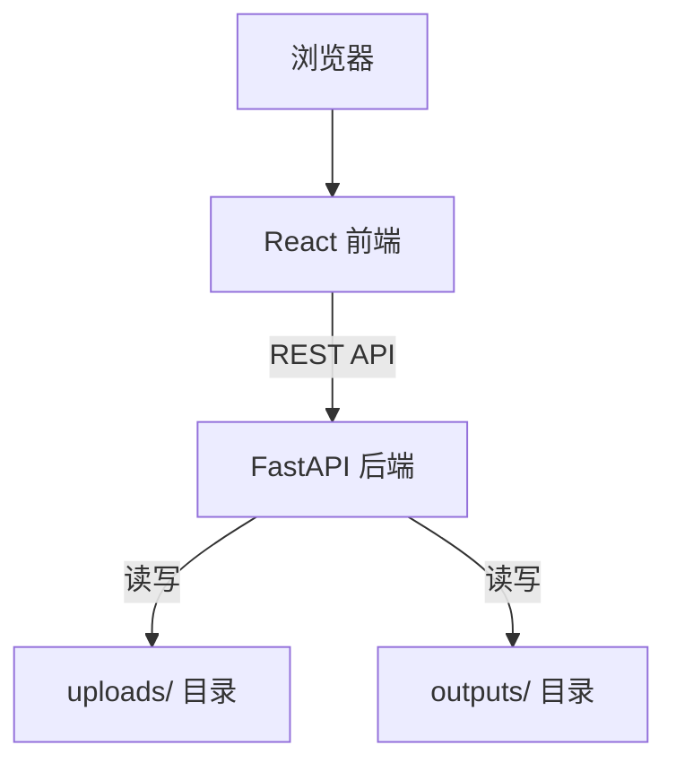

# Design: project-setup

## Overview
AI智能合同合规审查工具的项目脚手架。搭建 FastAPI 后端服务 + React 前端应用的完整开发环境，包含文件上传/下载基础流程，为后续三个核心模块（doc-parser, compliance-engine, report-output）提供可运行的骨架。

## Goals
- 提供可启动的后端 API 服务和前端 Web 应用
- 实现合同文件上传、列表查看、下载、删除的完整基础流程
- 建立清晰的项目结构和开发规范，便于后续模块集成

## Non-Goals
- 文档解析、合规分析、报告生成（后续 spec 负责）
- 用户认证和权限管理
- 数据库持久化存储
- 生产环境部署配置

## Boundary Commitments

### This spec owns
- 后端 FastAPI 应用骨架（入口、配置、中间件、路由注册）
- 前端 React 应用骨架（入口、布局、路由、API 客户端）
- 文件上传 API 和前端上传组件
- 文件管理 API（列表、下载、删除）和前端列表组件
- 开发环境启动脚本

### Out of Boundary
- 文档解析逻辑（doc-parser spec）
- 合规规则引擎和风险评分（compliance-engine spec）
- 修改建议生成和报告导出（report-output spec）
- 文件内容的业务处理（解析、分析、生成报告）

### Allowed Dependencies
- FastAPI 及其生态（uvicorn, python-multipart, pydantic）
- React 生态（vite, tailwindcss, axios, react-router-dom）
- Python 3.11+, Node.js 18+

### Revalidation Triggers
- 文件存储路径结构变更（影响 doc-parser 的输入）
- API 响应格式变更（影响所有下游 spec 的前端集成）
- 上传文件元数据模型变更（影响 compliance-engine 的批量处理）

---

## Architecture



**Dependency Direction**: Browser → Frontend → Backend API → File System

---

## Technology Stack

| Layer | Technology | Version | Role |
|-------|-----------|---------|------|
| Backend | FastAPI | 0.115+ | ASGI Web 框架 |
| Backend | uvicorn | 0.34+ | ASGI 服务器（热重载） |
| Backend | python-multipart | 0.0.18+ | 文件上传解析 |
| Backend | Pydantic | 2.x | 请求/响应模型验证 |
| Frontend | React | 18.x | UI 框架 |
| Frontend | Vite | 5.x | 构建工具（HMR） |
| Frontend | TailwindCSS | 3.x | 样式系统 |
| Frontend | TypeScript | 5.x | 类型安全 |
| Frontend | axios | 1.x | HTTP 客户端 |
| Frontend | react-router-dom | 6.x | 前端路由 |

---

## File Structure Plan

```
contract-review/
├── backend/
│   ├── app/
│   │   ├── __init__.py
│   │   ├── main.py                  # FastAPI 应用入口，注册中间件和路由 [1.1, 1.2, 1.3]
│   │   ├── config.py                # 应用配置（端口、目录路径、文件大小限制） [3.3]
│   │   ├── routers/
│   │   │   ├── __init__.py
│   │   │   ├── health.py            # 健康检查路由 [1.4]
│   │   │   └── files.py             # 文件上传/列表/下载/删除路由 [3.1-3.6, 4.1-4.3]
│   │   ├── models/
│   │   │   ├── __init__.py
│   │   │   └── file.py              # 文件相关 Pydantic 模型 [3.4, 4.1]
│   │   ├── services/
│   │   │   ├── __init__.py
│   │   │   └── file_service.py      # 文件操作逻辑（保存/列表/删除/获取） [3.4, 4.1-4.3]
│   │   └── middleware/
│   │       ├── __init__.py
│   │       └── error_handler.py     # 统一错误处理中间件 [1.3]
│   ├── requirements.txt             # Python 依赖
│   └── uploads/                     # 上传文件存储目录
├── frontend/
│   ├── src/
│   │   ├── App.tsx                  # 应用根组件，路由配置 [2.1]
│   │   ├── main.tsx                 # React 入口
│   │   ├── api/
│   │   │   └── client.ts            # axios 实例和 API 调用封装 [2.1]
│   │   ├── components/
│   │   │   ├── Layout.tsx           # 主布局（导航栏 + 内容区） [2.1, 2.2]
│   │   │   ├── FileUpload.tsx       # 文件上传组件（拖拽 + 进度条） [3.1, 3.5, 3.6]
│   │   │   └── FileList.tsx         # 文件列表组件（表格 + 操作按钮） [4.1, 4.2, 4.3]
│   │   ├── pages/
│   │   │   └── Home.tsx             # 首页（集成上传和列表） [2.1]
│   │   └── types/
│   │       └── index.ts             # TypeScript 类型定义 [2.1]
│   ├── package.json
│   ├── vite.config.ts               # Vite 配置（API 代理）
│   ├── tailwind.config.js
│   ├── tsconfig.json
│   └── index.html
├── outputs/                          # 生成的报告输出目录
├── contracts/                        # 测试合同样本目录
├── start.sh                          # 一键启动脚本 [5.3]
└── README.md                         # 项目说明和启动指南
```

---

## Components & Interfaces

### Component Summary

| Component | Domain | Intent | Requirements | Dependencies |
|-----------|--------|--------|--------------|--------------|
| FastAPI App | Backend | 应用入口，注册中间件和路由 | 1.1, 1.2, 1.3 | uvicorn, python-multipart |
| Health Router | Backend | 健康检查端点 | 1.4 | FastAPI App |
| Files Router | Backend | 文件操作 API 端点 | 3.1-3.4, 4.1-4.3 | FileService |
| FileService | Backend | 文件存储操作逻辑 | 3.4, 4.1-4.3 | 文件系统 |
| File Models | Backend | 请求/响应数据模型 | 3.4, 4.1 | Pydantic |
| Error Handler | Backend | 统一错误响应格式 | 1.3 | FastAPI middleware |
| React App | Frontend | UI 入口和路由 | 2.1 | react-router-dom |
| Layout | Frontend | 主布局和导航 | 2.1, 2.2 | TailwindCSS |
| FileUpload | Frontend | 文件上传交互 | 3.1, 3.5, 3.6 | axios |
| FileList | Frontend | 文件列表和操作 | 4.1, 4.2, 4.3 | axios |
| API Client | Frontend | HTTP 请求封装 | 2.1 | axios |
| Start Script | Infra | 一键启动开发环境 | 5.1, 5.2, 5.3 | shell |

### Backend: FastAPI App (`app/main.py`)
- 创建 FastAPI 实例
- 注册 CORS 中间件（允许前端开发服务器来源）
- 注册错误处理中间件
- 挂载 health router 和 files router
- **Interfaces**: Service/API
  - `GET /api/health` → `{"status": "ok", "version": "0.1.0"}`
  - CORS 配置: `allow_origins=["http://localhost:5173"]`

### Backend: Files Router (`app/routers/files.py`)
- **Interfaces**: Service/API
  - `POST /api/files/upload` — 接受 `multipart/form-data`，字段名 `file`
    - 请求: `UploadFile`（FastAPI 内置类型）
    - 响应: `FileUploadResponse`（含 file_id, filename, size, upload_time）
    - 校验: 文件扩展名 ∈ {`.pdf`, `.docx`}，大小 ≤ 100MB
    - 存储: `uploads/{uuid}/{original_filename}`
  - `GET /api/files` — 返回已上传文件列表
    - 响应: `FileListResponse`（含 `files: list[FileInfo]`）
  - `GET /api/files/{file_id}/download` — 下载指定文件
    - 响应: `FileResponse`（FastAPI 内置）
  - `DELETE /api/files/{file_id}` — 删除指定文件及其目录
    - 响应: `{"message": "deleted", "file_id": "..."}`

### Backend: FileService (`app/services/file_service.py`)
- **Interfaces**: Service
  - `save_file(file: UploadFile) -> FileInfo` — 保存上传文件，生成 UUID 目录
  - `list_files() -> list[FileInfo]` — 扫描 uploads/ 目录返回文件列表
  - `get_file(file_id: str) -> tuple[Path, str]` — 返回文件路径和文件名
  - `delete_file(file_id: str) -> bool` — 删除文件目录

### Backend: Data Models (`app/models/file.py`)
```python
class FileInfo(BaseModel):
    file_id: str
    filename: str
    size: int           # bytes
    upload_time: str    # ISO 8601
    status: str         # "uploaded" | "processing" | "completed"

class FileUploadResponse(BaseModel):
    file_id: str
    filename: str
    size: int
    upload_time: str

class FileListResponse(BaseModel):
    files: list[FileInfo]

class ErrorResponse(BaseModel):
    error_code: str
    message: str
    detail: str | None = None
```

### Backend: Error Handler (`app/middleware/error_handler.py`)
- 捕获所有未处理异常，返回统一 `ErrorResponse`
- HTTP 异常（如 404、413）转换为标准格式
- 文件格式/大小校验失败返回 400

### Frontend: API Client (`src/api/client.ts`)
- 创建 axios 实例，baseURL 指向后端（开发环境通过 Vite 代理）
- 封装文件上传（含进度回调）、文件列表、下载、删除的 API 调用
- TypeScript 接口与后端模型对齐

### Frontend: FileUpload (`src/components/FileUpload.tsx`)
- 支持点击选择和拖拽上传
- 显示上传进度条
- 上传完成后刷新文件列表

### Frontend: FileList (`src/components/FileList.tsx`)
- 表格展示：文件名、上传时间、大小、状态
- 每行操作按钮：下载、删除
- 删除时弹出确认对话框
- 数据为空时显示空状态提示

---

## Testing Strategy

| Test Area | Items | Approach |
|-----------|-------|----------|
| 健康检查 | GET /api/health 返回 200 和 status 字段 | 后端单元测试 |
| 文件上传-正常 | 上传 PDF/DOCX 返回 file_id 和元数据 | 后端集成测试 |
| 文件上传-格式校验 | 上传 .txt 文件返回 400 错误 | 后端集成测试 |
| 文件上传-大小校验 | 上传超 100MB 文件返回 413 错误 | 后端集成测试 |
| 文件列表 | 上传后列表包含该文件 | 后端集成测试 |
| 文件下载 | 下载内容与上传内容一致 | 后端集成测试 |
| 文件删除 | 删除后列表不再包含该文件 | 后端集成测试 |
| CORS | 前端可成功调用后端 API | 前端 E2E |
| 上传进度 | 上传过程中显示进度条 | 前端组件测试 |
| 错误提示 | 上传失败时显示错误信息 | 前端组件测试 |

---

## Requirements Traceability

| Requirement | Components | Interfaces |
|-------------|-----------|------------|
| 1.1 API路由注册 | FastAPI App | main.py 路由挂载 |
| 1.2 CORS跨域 | FastAPI App | CORS middleware 配置 |
| 1.3 统一错误响应 | Error Handler | ErrorResponse 模型 |
| 1.4 健康检查 | Health Router | GET /api/health |
| 2.1 主页面布局 | React App, Layout, Home | App.tsx 路由 + Layout 组件 |
| 2.2 响应式适配 | Layout | TailwindCSS 响应式类 |
| 2.3 加载状态 | FileList, FileUpload | 加载指示器组件 |
| 3.1 上传界面 | FileUpload, Files Router | POST /api/files/upload |
| 3.2 格式校验 | Files Router | 扩展名白名单校验 |
| 3.3 大小限制 | Files Router, config.py | 100MB 限制配置 |
| 3.4 存储标识 | FileService | UUID 目录生成 |
| 3.5 上传进度 | FileUpload | axios onUploadProgress |
| 3.6 成功确认 | FileUpload | 上传成功 toast |
| 4.1 文件列表 | FileList, Files Router | GET /api/files |
| 4.2 文件下载 | FileList, Files Router | GET /api/files/{id}/download |
| 4.3 文件删除 | FileList, Files Router | DELETE /api/files/{id} |
| 5.1 后端热重载 | uvicorn | --reload 参数 |
| 5.2 前端热重载 | Vite | HMR 默认启用 |
| 5.3 一键启动 | start.sh | shell 脚本 |
